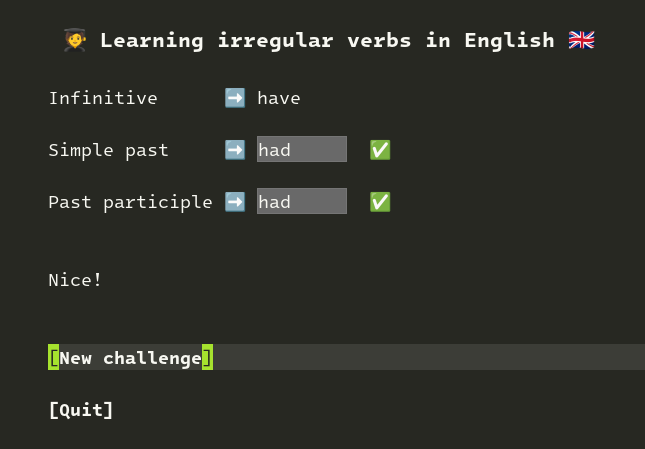
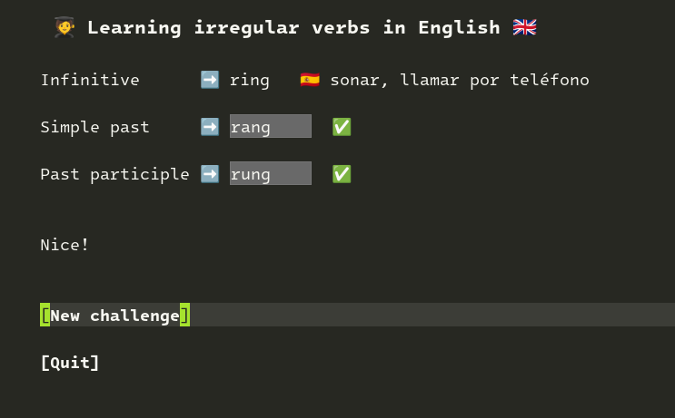

# Lirve: Learn irregular English verbs in Emacs

Lirve helps you learn irregular verbs using the spaced repetition technique. In other words: Lirve remember your mistakes and repeat the challenge in the future.



## Install

### MELPA

```
M-x package-install RET lirve RET
```

And add the following to your `init.el`:

```elisp
(require 'lirve)
```

### Straight

Then, add it to your `init.el`.

```elisp
(use-package lirve
  :straight (:host github :repo "tanrax/lirve.el" :files ("lirve-verbs.el" "lirve.el"))
  :ensure t)
```

And add the following to your `init.el`:

```elisp
(require 'lirve)
```

## Configure (Optional)

Shows the translation of the verb when resolving or failing.



Only available in Spanish (at the moment).

```elisp
(setq lirve--set-translation 'es)
```

## Usage

```
M-x lirve
```

I also recommend creating a function to make it easier to remember the command.

```elisp
(defun learning-irregular-verbs-in-english ()
  "Start Lirve."
  (interactive)
  (lirve))
```

```
M-x learning-irregular-verbs-in-english
```

## Controls

| Key | Description |
| --- | --- |
| `TAB` | Move to the next field |
| `S-TAB` | Move to the previous field |
| `RET` | Click on the button |

## Collaborate

If you want to add more languages, make a PR with the translations in `lirve-verbs.el`.

For example, the verb `beat` in Italian and Spanish:

```elisp
(
    (infinitive . "beat")
    (simple-past . "beat")
    (past-participle . "beaten")
    (translations
        (es . "golpear")
        (it . "colpo")))
```
